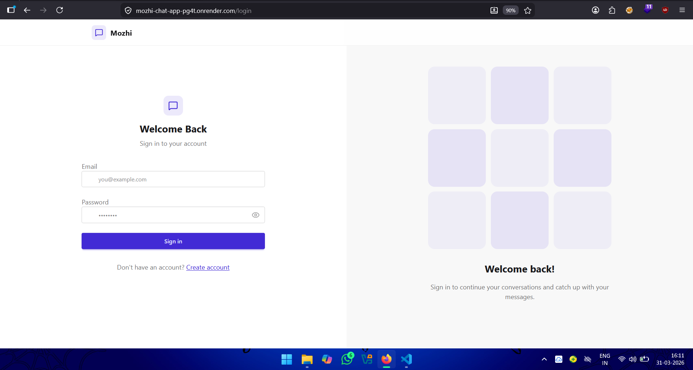
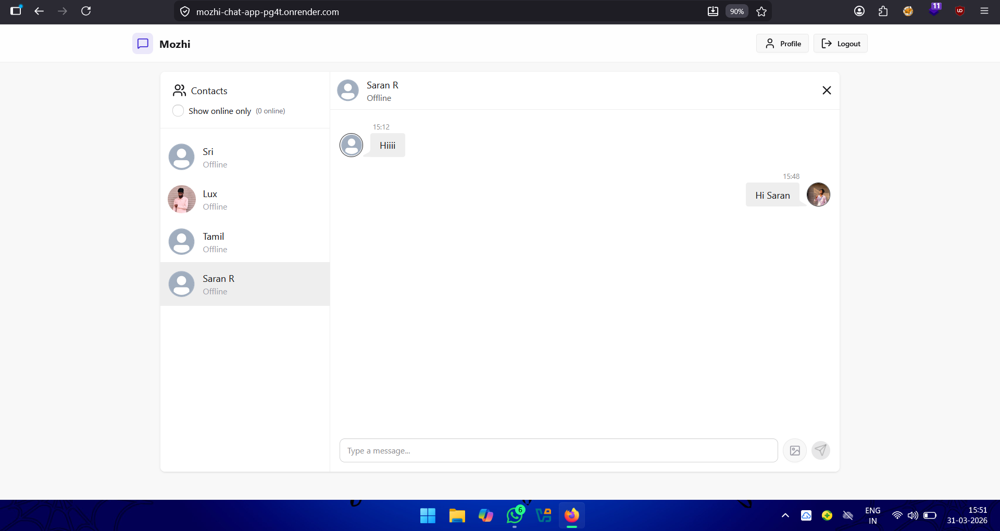

# 🚀 Real-Time Chat Application (MERN Stack)

A full-stack real-time chat application built using the **MERN Stack** with Socket.io for live communication.

You can try the app and send me a message in real time 💬

---

## 🔗 Links

🔗 GitHub Repo: [View Source Code](https://github.com/ssriram-siva/Mozhi-Chat-App/)  
🌐 Live Demo: [Try the App](https://mozhi-chat-app-pg4t.onrender.com/)

---

## 🛠️ Tech Stack

- MongoDB
- Express.js
- React.js
- Node.js
- Socket.io

---

## ⚙️ Features

- 💬 Real-time messaging using Socket.io  
- 🔐 Secure authentication system (login/signup)  
- 👤 One-to-one chat functionality  
- 📱 Fully responsive UI  
- ⚡ Fast and scalable backend architecture  
- 🗄️ MongoDB for efficient data storage  

---

## 📸 Project Preview

### 🔐 Login Page

### 💬 Chat Interface

---

## 💡 What I Learned

- Real-time communication using WebSockets (Socket.io)
- Event-driven backend architecture
- Full-stack MERN application structure
- Handling live messaging and state updates
- Authentication and protected routes

---

## 🚀 Try It Out

👉 [Click here to open the live app](https://mozhi-chat-app-pg4t.onrender.com/)

💬 You can sign up and send me a message instantly!

---

## 📌 Feedback

I would really appreciate feedback and suggestions from fellow developers 🙌

---

## 🏷️ Tags

`#MERNStack` `#ReactJS` `#NodeJS` `#ExpressJS` `#MongoDB` `#SocketIO` `#FullStackDevelopment`
